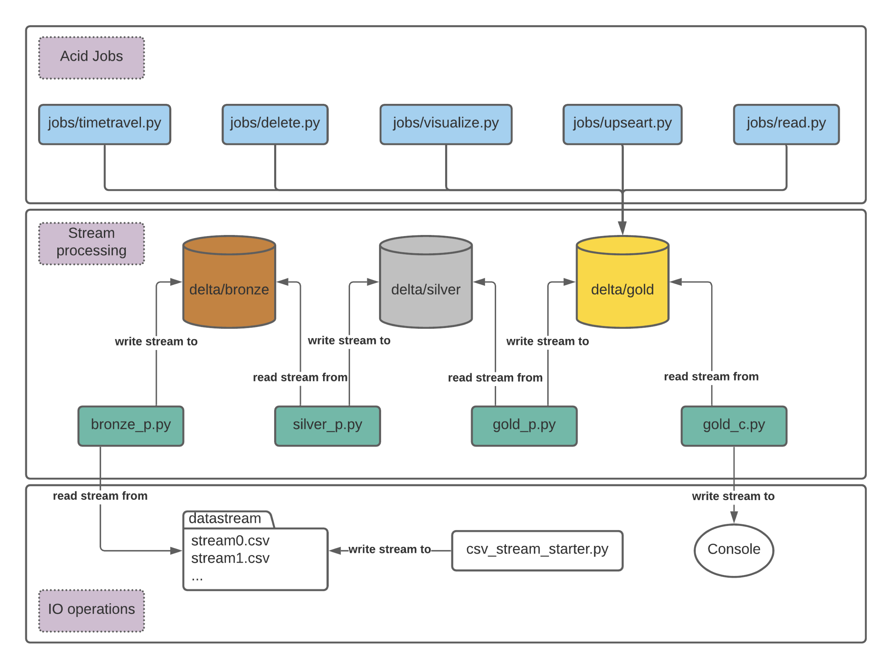

# Stock Data Processing in Delta Lake
#### Danil Astakhov CSCI E-63 Big Data Analytics Spring 2021

### Statement
Development of an ACID-compliant storage architecture and streaming processing of stock market data based on Databricks Delta Lake.
### Problem Description
Designing the storage architecture is an essential part in big data solutions engineering. The central issue of these tasks is the choice of persistent storage. Even though Data Lake and Data Warehouse are powerful tools, the classic solutions based on them have a high complexity of application architecture. Just as difficult is the implementation of CRUD scripts in storage. Architectures based on Delta Lake are designed to eliminate these drawbacks. This paper presents the implementation of Delta Lake architecture for stock market data. The stock market is a suitable data model for data streaming, moreover, there is a wide scope for Business Intelligence.

### High level overview of steps
* Data stream initialisation;
* Delta Lake pipeline setup (Bronze -> Silver -> Gold);
* ACID Jobs on Gold layer; 
* Timetravel on Gold layer;
* Visualisation.

### Architecture

### Software
* macOS BigSur Version 11.3.1 Darwin Kernel Version 20.4.0
* ApacheSpark:spark-3.1.1-bin-hadoop3.2
* Python3.9.2, Clang12.0.0(clang-1200.0.32.29)on darwin
#### Python packages
* deltalake 0.4.7
* pandas 1.2.4
* plotly 4.14.3

### Big Dataset
[S&P500](https://www.kaggle.com/camnugent/sandp500)
Historical stock data for all current S&P 500 companies

### Summary
Delta Lake is a new chapter in the development of Big Data solutions. Combination of convenient DataFrame interface, storage organisation transparency, ACID-compatibility, batch-stream processing, metadata as Big Data opens up opportunities for building extremely large, scalable and durable storages and Big Data processing systems in financial and other fields.
